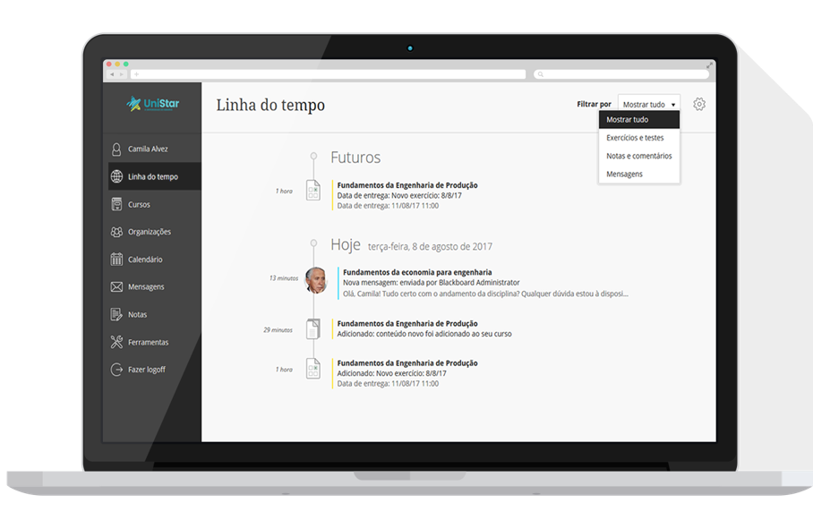

<div align="center" id="top">
  

  &#xa0;

</div>

<h1 align="center">Bbnotify</h1>

<p align="center">
  

  

  

  

</p>

<!-- Status -->

<h4 align="center">
	🚧  BB Notify 🚀 Work in progress...  🚧
</h4>

<hr>

<p align="center">
  <a href="#dart-about">About</a> &#xa0; | &#xa0;
  <a href="#sparkles-features">Features</a> &#xa0; | &#xa0;
  <a href="#rocket-technologies">Technologies</a> &#xa0; | &#xa0;
  <a href="#white_check_mark-requirements">Requirements</a> &#xa0; | &#xa0;
  <a href="#wrench">Settings</a> &#xa0; | &#xa0;
  <a href="#checkered_flag-starting">Starting</a> &#xa0; | &#xa0;
  <a href="#memo-license">License</a> &#xa0; | &#xa0;
  <a href="https://github.com/nodgear" target="_blank">Author</a>
</p>

<br>

## :dart: About ##

Describe your project

## :sparkles: Features ##

:heavy_check_mark: Feature 1;\
:heavy_check_mark: Feature 2;\
:heavy_check_mark: Feature 3;

## :rocket: Technologies ##

The following tools were used in this project:

- [Node.js](https://nodejs.org/en/)
- [Pupeteer](https://github.com/puppeteer/puppeteer)
- [Discord.JS](https://discord.js.org/)
- [Pupeteer Better Evaluate](https://www.npmjs.com/package/puppeteer-evaluate2)

## :white_check_mark: Requirements ##

Before starting :checkered_flag:, you need to have <br>
[Yarn](https://yarnpkg.com/) and [Node](https://nodejs.org/en/) installed.<br>
[Git](https://git-scm.com) Is optional, but recommended

## :wrench: Settings ##

### Settings up BlackBoard
```bash
  # To setup your BlackBloard settings change the value from .envExample
  nano .envExample

  # Now rename it to .env or just create a new one
  mv .envExample .env

  # If you are using windows, just open .envExample, change to your information and rename it to .env
```
### Setting up the discord webhook: ###
 - Go to your discord server, and click {Edit channel} where you want to receive updates<br>
 
 - Navigate to Integrations and create a new Webhook.
 
 - You webhook should look like this: https://discord.com/api/webhooks/12345678912356789/32QoUL-6GL4H31MM2otK-Llw86hD5VDJ6WjjVJem4D35LpqdasdaadsM0MOXqzJmZP3lm
- - The first part (12345678912356789) is your Webhook ID
- - The second part (32QoUL-6GL4H31MM2otK-Llw86hD5VDJ6WjjVJem4D35LpqdasdaadsM0MOXqzJmZP3lm) is your webhook Token!

- Navigate to the project folder > config and open discord.json
```bash
cd bbnotify
cd config
nano discord.json

# If you're using windows, just open the discord.json file
```
- Replace everything by your liking, remember to paste your webhook id and token!
- That's it!

## :checkered_flag: Starting ##

```bash
# Clone this project
# Download repository if you don't have GIT installed
$ git clone https://github.com/nodgear/bbnotify

# Access
$ cd bbnotify

# Install dependencies
$ yarn --production=false

# Run the project
$ yarn start

# For developer mode:
# First install the developer dependencies
$ yarn install --production=false

# Now you can start devmode by running
$ yarn dev

# In developer mode you can see everything BB Notify is doing in real time and changing files will automatically restart the server.
```

## :memo: License ##

This project is under license from GNU GPL 3. For more details, see the [LICENSE](LICENSE.md) file.


Made with :heart: by <a href="https://github.com/nodgear" target="_blank">Nodge</a>

&#xa0;

<a href="#top">Back to top</a>
